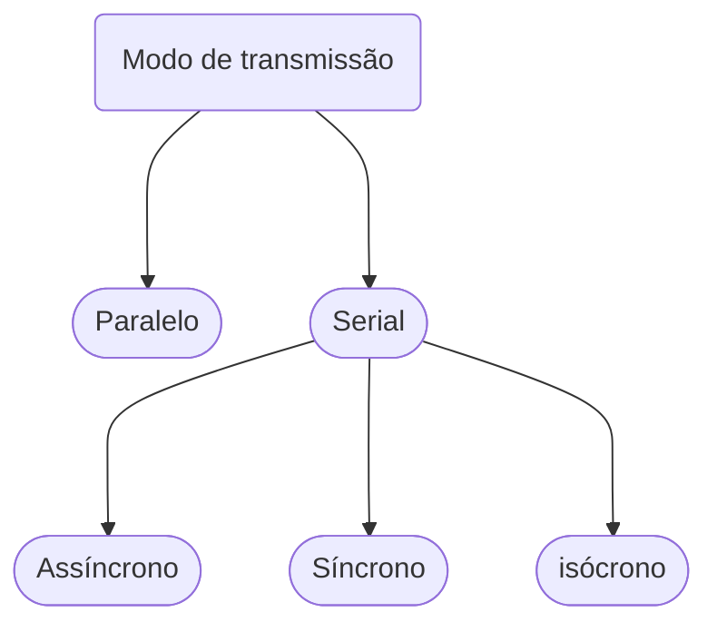
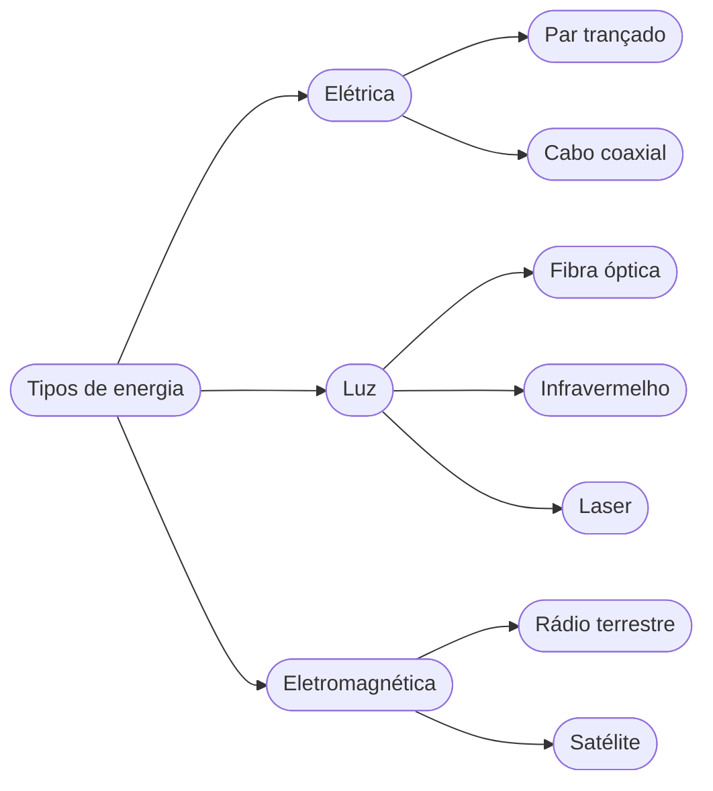

# 1. Camada e meio físico

***

No meio físico, a transmissão dos dados pode ser analógica(sinal contínuo, geralmente uma onda senoidal), ou digital (0, 1)

A comunicação é feita entre o *emissor* e o *receptor*, a partir da troca de *sinais eletromagnéticos* entre eles.
Uma das funções da *camada física* é fazer o roteamento (traçar o caminho dos dados) de bits entre os nós da rede.

## 2. Transmissão digital 

A transmissão digital envia *sinais digitais*  pelo meio canal de comunicação, esses sinais tem a amplitude que varia entre 0 e 1. Esse tipo de transmissão precisa de *sincronização* a cada período de dento.

A conversão de dados digitais utiliza **três** principais técnicas:

### 2.1 Codificação de linha

**Converte dados digitais em sinais digitais**, os dados podem ser texto, número, imagens, audios e etc, mas sempre serão armazenadas na memoria do computador na forma de uma sequência de bits.

No emissor os dados digitais são convertidos em sinais digitais(conversão digital-digital)

#### Esquemas para codificação mais comuns

- Polar: Nivel de tensçao varia entre positivo(+) e negativo (-)

- Bipolar: tensão positiva, negativa e zero

### 2.2 Codificação de bloco
Tem um d*esempenho melhor do que a codificação de linha* pois provê a **redundância necesária para possibilitar a sincronização**, e, um processo de **detecção de erro simplificado**.

Nesse tipo de codificação, um bloco de bits é transformado em outro bloco de bits, maior que o inicial, Geralmente a codificação de bloco consiste nas etapas de *divisão*, *substituição* e *combinação*.

- Divisão: Uma sequência de bits é dividia em grupos

- Substituição: Um grupo de bits é substituido por outro

- Combinação: Quando os grupos são recombinados formando um fluxo de bits *maior que o original*.

### 2.3 Embaralhamento
Utilizado quando é preciso *substituir longos pulsos de nivel zero por uma combinação de outros niveis*.

## Transmissão analógica
Utiliza ondas (geralmente senoidais), modificando alguma de suas caracteristicas:

- amplitude
- frequência
- fase

A transmissão analógica pode transmitir tanto dados analógicos quanto digitais.

Na transmissão de dados analógicos, existe um esquema em que os dados que vão ser transmitidos, são passados diretamente, de forma analógica. Dessa forma, é necessário que o equipamento terminal do circuito de dados, alterne de maneira continua o sinal que deve ser transmitido e a *onda portadora*.
Com isso, a onda de transmitida deve ser formada pela combinação de *onda-portadora* e *mensagem*

- Para transmitir dados digitais de maneira analógica foi criado o *modem*, que **converte digital em analógico para a emissão e vice-versa para recepção**.

## 3. Modulação e Multiplexação

Para a *mensagem se adequar ao meio de transmissão, precisamos codificar as mensagens adequando-as ao padrão exigido pelo meio.*

### 3.1 Modulação

A modulação é responsável por *converter os dados (analógicos/digitais) em sinal que possa ser transmitido.*

- O processo de **hardware** que prepara os dados para uma *onda portadora* é chamado de **modulador**

- O que *reconstrói a sequência de bits* recebidos pela onda portadora é chamado **demodulador**

### 3.1.1 Modulação de amplitude
Varia a *amplitude* da onda portadora, que continua oscilando em uma *frequência proporcionalmente igual*, estes *períodos de variação, correspondem aos **bits***

### 3.1.2 Modulação de frequência
A **amplitude permanece** inalterada e o que se modifica de acordo com o sinal é a frequência.

### 3.1.3 Modulação por descolamento de fase
Desloca o *tempo de referência* na onda-portadora

- Raramente se utiliza esse tipo de modulação, isso *acontece devido a atrasos* nas ondas para **sincronizar novamente** após um desvio, **aumentando o delay**

### 3.2 Multiplexação

A multiplexação é a técnica que permite que mais de um sinal seja transmitido pelo mesmo meio físico dividindo o meio em canais.

O principal objetivo é compartilhar o meio físico entre várias conexões independentes e simultâneas, dividindo a capacidade de transmissão de um meio ou da banda passante desse meio em proporções menoresm, buscando obter canais lógicos independentes no mesmo meio.

O canal lógico é um elemento físico, tem caracterização física e não pode ser confundido com o conceito de circuito ou *canal virtual* 

Quando a transmissão de dados começou a se tornar importante, a maior parte das fontes de informação eram praticamente todas analógicas (rádio, televisão, telefonia, etc), por isso era muito usada a mutiplexação por frequência, que tem como caracteristicas:

- tipo mais antigo de multiplexação
- aplicar-se muito bem a sinais analógicos
- ser pouco eficiente pois precisa de *banda de resguardo*
- precisar de um hardware especifico para cada canal lógico
- custo alto e implementação complicada

Com o passar do tempo as fontes de informação tornaram-se majoritariamente digitais, assim a multiplexação por tempo passou a ser mais comum, suas principais caracteristicas são:

- aplicar se muito bem a sinais digitais 
- ser muito eficiente e não precisar de quase nada de tempo de resguardo
- implementação mais simples, por **software** ou **hardware**
- custo baixo

## 4 Modos de transmissão e largura de banda 

O termo *modo de transmissão* é utilizado para fazer referência à forma como os dados são enviados de um ponto a outro. Geralmente os modos de transmissão são divididos em dois tipos: a paralela e a serial

A transmissão paralela é o tipo de transmissão em que vários *bits* são enviados de uma só vez, e a transmissão sérial é o tipo de transmissão em que um *bit* é enviado por vez. Na transmissão serial, existe categorização de acordo com o tempo de transmissão.

### 4.1 Transmissão paralela

Como dito antes é o tipo de transmissão onde vários *bits* são transmitidos simultaneamente, por meios de transmissão separados, geralmente fios independentes.

Os sinais em todos os fios são sincronizados, isto é, cada bit trafega em cada um dos fios exatamente ao mesmo tempo.Além disso uma interface paralela possui outros fios que vão permitir que o emissor e o receptor possam ser coordenados. Outra caracterisca notável é que os fios de um sistema de transmissão paralelo ficam em um **único cabo físico**, Tendo assim uma unica "conexão" entre o emissor e o receptor.

#### Principais vantagens da transmissão paralela

- Alta banda passante, pois é possivel enviar *vários bits simultâneamente*.

- A estrutura lógica do hardware de comunicação utiliza circuitos paralelos, tendo assim semelhança ao tipo de transmissão.

### 4.2 Transmissão Serial

Esse tipo de transmissão envia um bit por vez. Apesar de não ser intuitivo o porque optar pela transmissão serial, principalmente em termos de velocidade de transmissão, **uma grande parte dos sistemas** utiliza esse modo de transmissão, e esse preferência se da por:

- Custo reduzido, pois são necessários menos fios, e os componentes utiizados são mais simples e mais baratos

- Os sitemas de transmissão paralelo exigem que todos os fios tenha o mesmo comprimentando, pois uma diferença milímetros pode gerar problemas na transmissão.

- Os sinais nos fios paralelos podem causar **ruídos eletromagnéticos** que vão causar interferência com os outros fios quando falamos de taxas de transferências elevadas.

Para utilizar a transmissão serial, tanto emissor quanto receptor precisam ter um módulo de hardware que faz a **conversão** dos dados da forma paralela utilizada no dispositivo para a forma serial utilizada no fio.

Os mecanismos em um sistema serial são divididos em três tipos, dependendo de como as transmissões ficam dividias ao longo do tempo

#### Transmissão assíncrona:
é o tipo de transmissão que ocorre a qualquer momento, tendo um tempo de espera aleatório entre as transmissões. Esse tipo de sistema permite que o meio físico se mantenha inativo por um tempo indeterminado entre as transmissões, sendo assim o tipo de transmissão ideal para aplicações que geram dados sem um intervalo de tempo definido.

#### Transmissão síncrona:
Acontece de forma continua, sem nenhum intervalo de tempo de espera entre as transmissões dos dados, Quando finalazada a transmissão do ultimo bit de um byte, o emissor transmite um bit do próximo byte de dados, oque avisa o receptor que a transmissão vai continuar. A principal vantagem é que ambos, emissor e receptor ficam sincronizados o tempo todo, não perdem a coordenação entre eles;

#### Transmissão isócrona:
Acontece em intervalos de tempo fixo entre as transmissões dos itens de dados. Ele pode ser visto como uma variação do tipo de transmissão síncrona, e foi elaborado para oferecer um fluxo contínuo de bits, utilizado em aplicações de voz ou de vídeo (uma vez que atrasos atrapalham a comunicação) pois entrega dados a uma taxa constante. 

## 5 Largura de Banda
 
O termo largura de banda consiste na faixa de frequências ocupada pelo sinal modelado e pode fazer referência tanto à transmissão de dados analógica quanto a digital.

#### Largura de banda de sinal analógico:
esse tipo de largura de banda pode ser definido como a diferença entre as frequências mais baixas e mais altas das partes integrantes do sistema.

Para o calculo utiliza-se a **análise de Fourier** para saber as frequências maiores e menor 

Por exemplo:
Imagina-se que um sistema produz sinais de 1 e 2 Hz, significa que a largura de banda de sinal analógico é de **1 Hz**

#### Largura de banda de sinal digital:
Tambem utiliza a análise de Fourier para encontrar as ondas senoidas integrantes do sistema e, assim, poder verificar as frequências. Quando aplicamos essa análise a uma **onda quadrada** (sinal digital) é produzido um conjunto infinito de ondas senoidais, que seguem até o infinito. Nesse sentido é possivel compreender que a largura de banda de um sinal digital é infinita, pois as frequências crescem até o infinito.

## 6 Transmissões guiadas e não guiadas
Para as transmissões, usamos os termos *guiada* e *não guiada* a fim de distinguir entre as mídias físicas, fios e fibras ópticas por exemplo são guiadas, pois fornecem um caminho exato, diferende de ondas de rádio que abragem um determinado espaço em geral.

## 7 Taxonomia das redes por formas de energia 
Tambem podemos classificar os meios físicos pela forma de energia usada para transmitir os dados.

## Radiação de fundo e ruído elétrico

Como provavelmente você aprendeu em física: a corrente elétrica flui ao longo de um circuito completo. Assim, todas as transmissões de energia precisam pelo menos de dois fios, um para o receptor, e outro para o retorno do emissor. A forma mais simples de fiação consiste em um cabo que contém dois fios de cobre, cada um envolto em um revestimento de plástico para isolamento elétrico. 

As redes de computadores costumam usar uma forma alternativa de fiação devido a três principais fatos:

- *A radiação eletromagnética randômica*, chamada de **ruido**. permeia o ambiente.

- O ruido pode infeterferir nos sinais de comunicação

- Os metais podem agir como blindagem, se postos entre a fonte de ruido e o meio, podendo ser usado como "escudo"

### Par trançado (cobre)

Temos tres tipo de fiação para ajudar a reduzir a interferência do ruido elétrico:

- Par trançado não blindado ou **UTP** (*Unshielded twisted pair*)
- Cabo coaxial
- Par trançado blindado ou **STP** (*Shielded twisted pair*)

O par trançado não blindado (UTP), é sem duvidas o mais comum de todos os tipos.

Surpreendentemente ao trançarmos os dois fios, tornamos o cabo menos sucetivel a inteferencia do ruido, isso acontece porqueexiste uma alta probabilidade de que um deles esteja mais próximo da fonte de radiação eletromagnética do que o outro. Na verdade, um fio tende a agir como uma blindagem que absorve parte da radiação eletromagnética, se trocamos constantemente a posição dos fios constamente durante o comprimento do cabo (trançando eles), a diferença entre 

Por que a igualdade de absorção é importante? A resposta é que, se a interferência
induzir exatamente a mesma quantidade de energia elétrica em cada fio, nenhuma cor-
rente extra fluirá. Assim, o sinal original não será perturbado.

### Blindagem: coaxial e STP
Embora resistente a maioria dos ruidos comuns, o par trançado ainda tende a ter problemas com ruidos muito fortes, ou a proximidade muito grande de fontes de ruido.
Para lidar com situações onde o par trançado convencional não é suficiente, podemos usar o cabo coaxial (cabo de tv a cabo), que possui uma blindagem grossa formada de uma malha de metal que envolve um fio central responsavel por efetivamente transportar o sinal desejado

Quanto mais resistencia a ruidos ganhamos, mais flexibilidade perdemos, por isso, soluções como o par trançado blindado STP, foram criadas, geralmente a blindagem dos cabos é construida por uma lamina metalica, quase que um papel aluminio. E é o meio termo entre a flexiblidade de um par trançado comum e a resistencia a ruidos de um coaxial.

### Categorias de cabo par trançado

O American National Standards Institute (ANSI), a Telecommunications
Industry Association (TIA) e a Electronic Industries Alliance (EIA) criaram uma lista de
categorias de cabeamento, com especificações rigorosas para cada uma:

|categoria|descrição|taxa de transmissão (Mbit/s)|
|:-----:|:-----:|:------------------------:|
|CAT 1|Par trançado não blindado de telefonia|<0,1|
|CAT 2|Par trançado não blindado usado para dados T1|2|
|CAT 3|CAT2 melhorado usado para redes de computadores|10|
|CAT 4|CAT3 melhorado usado para redes Token Ring|20|
|CAT 5|Par trançado não blindado utilizado em redes locais|100|s
|CAT 5E|CAT5 estendido para maior imunidade a ruídos|125|
|CAT 6|Par trançado não blindado testado para 200 Mbit/s|200|
|CAT 7|Par trançado blindado com lâmina metálica adicional envolvendo todo o cabo mais blindagem em torno de cada par trançado|600|

## Luz e fibras ópticas

O meio mais importante que faz a utilização da luz para o transporte de dados é a **fibra óptica**. Uma fibra nada mais é do que um pequeno fio de vidro (geralmente) ou de plástico transparente, envolto por um isolante de plástico.
Tipicamente uma fibra é utilizada para a comunicação em uma **única direção**, uma das suas extremidades é conectada a uma fonte de luz (laser ou LED), e a outra extremidade é conectada a um dispositivo fotossensível que detecta as variações na luz recebida. Obviamente para uma conexão de de duas vias, são necessárias duas fibras, sendo assim um cabo de fibra óptica deve ter no minimo duas fibras.
Devido a sua natureza, uma fibra **não pode ser dobrada em angulo reto**, mas ainda assim é flexivel o suficiente para formar um círculo com diâmetro de aproximadamente duas polegadas (mais ou menos 5 centimetros) sem se quebrar.

Mas como a luz viaja por uma curva na fibra?

Na física, quando a luz encontra o limite entre duas substâncias, o seu comportamento varia da densidade das substâncias e do ângulo de incidencia da luz.
Para um dado par de substâncias existe um **ângulo crítico** (`θc`) e representa o ângulo máximo em que a luz pode ser **refratada** em uma interface entre dois meios.