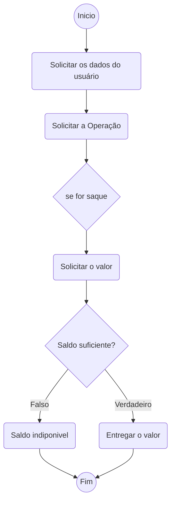

# Lógica de programação : Introdução
***

## Algoritmo: apresentação

Um algoritmo nada mais é do que uma sequência ou conjunto de passos para realizar uma determinada tarefa, não é necessariamente algo ligado a tecnologia.

por exemplo: precismaos de um algortimo para preparar um hamburguer

1. Cortar o pão e abri-lo
2. lavar a alface
3. fritar o hamburguer
4. colocar o hamburguer no pão
5. colocar uma fatia de queijo e uma folha de alface sobre o hamburguer
6. fechar o pão 

Não existe uma única forma, neste momento o importante é concluir a tarefa, não importando a eficiência ou a qualidade.

Você deve se perguntar "oque isso tem a ver com programas de computadores?", e eu te respondo: Absolutamente tudo!

Os programas de computadores são conjuntos de instruções que o computador precisa realizar para poder concluir uma determinada tarefa, apenas o foco é diferente. Os algortimos estão em várias áreas, medicina, bolsa de valores, mobilidade urbana, entre outros. Devido a isso, aprender a escrever algortimos e torná-los eficientes é uma habilidade muito importante atualmente.

## Comandos, váriaveis, expressões e instruções

No exemplo do hamburguer, ainda precisamos saber como definir quais realmente são os passos necessários afinal, cada pessoa pode definir isso de uma maneira pessoal. Isso também poderia acontecer enquanto escrevemtos um programa de computador, portanto, em computação geralmente costuma-se padronizar grande parte dos conceitos envolvidos.

Por meio de **comandos**, podemso formar **instruções** e as **expresões**. Com os comandos o computador entende oque ele deve fazer e por isso podem ser considerados a base de um algortimo.

Existem vários tipos de comandos: comandos para atribuição de valor, comandos para entrada e saída de dados. 

> Comando denota uma ação (ou conjunto delas) que o computador irá executar, tem forma definida e deve se atentar a padrões e regras.

Outra definição que usaremos a partir de agora é a de **váriaveis**.

Durante a execução de um programa, dados são trocados com o computador que executa o programa, esse programa trabalha em cima dos dados entregues à ele e nos devolve outro dado, que por sua vez precisa ser armazenado na memória do computador. Essa região na memória onde guardamos esses dados (mesmo que temporariamente), chamamos de **váriavel**, obviamente, como o própio nome diz, pode sofrer *variação de valor*.

Para podermos usar váriaveis na programação, primeiro precisamos cria-las, chamamos esse processo de "*declaração de uma váriavel*", cada váriavel declarada tem um **nome** e um **tipo**.

Agora com as *váriaveis* e os *comandos* podemos formar as intruções e/ou expressões. Uma **expressão** é a combinação de *variáveis, comandos e operadores. Já uma **instrução** é uma expressão única, que é executada pelo computador, e são formadas por comandos e variáveis.

## Representação de um algoritmo

Como sabemos que um algortimo são uma sequência de passos, que segue ordem e lógica, podemos facilitar relativamente a interpretação (e contrução) de um modelo de algoritmo utilizando fluxogramas e diagramas.

por exemplo: Operação desaque em um caixa eletronico

## Execução: Compilação e interpretação

O processo de desenvolver um *programa de computador* passa pelas seguintes etapas:

1. Entender o problema ou a tarefa que precisamos executar.

2. Desenvolver um algoritmo.

3. Escrever o algoritmo em uma *linguagem de programação* (código-fonte).  

4. Enviar o programa para o hardware, compilando ou interpretando o código.  

Agora que sabemos oque é um programa de computador, precisamos da etapa de realizar" a tarefa em si, chamamos isso de "executar o programa", existem duas maneiras para isso

- Compilar um arquivo é traduzir de uma linguagem para outra, quando compilamos um código, traduzimos ele para uma linguagem que o computador entende no caso a *linguagem de maquina* (linguagem de nivel mais baixo). Geralmente linguagems de **baixo-nivel** como, C, C++, Erlang, entre outras.

    - Linguagens compiladas são mais velozes na execução. Como nesse tipo de linguagem o código e convertido diretamente para linguagem de maquina, a execução e consideravelmente mais eficiente, principalmente se tratando de sistemas de alta complexidade.

- Outras linguagens são interpretadas. O código é passado ao intepretador que utiliza as intruções do código executa-as de maneira direta, não realizando a tradução de todo o código fonte. Geralmente linguagens de **alto nivel** como python, java, ruby, entre outros.

    - As linguagens interpretadas não precisam ser totalmente traduzidas para um código de máquina, inicalmente sofria sem sombra de duvidas com a velocidade e a eficiencia na gestão da memoria do computador, porem, com o passar do tempo e a invenção da tecnologia *just-in-time*(JIT) essa desvantagem reduzia drasticamente.

    - Entretanto, um programa compilado precisa ser gerado para cada plataforma onde for ser executado ( Windowns, Mac, Linux, etc...) já os interpretados podem ser executados em qualquer máquina, bastando apenas seu interpretador.

